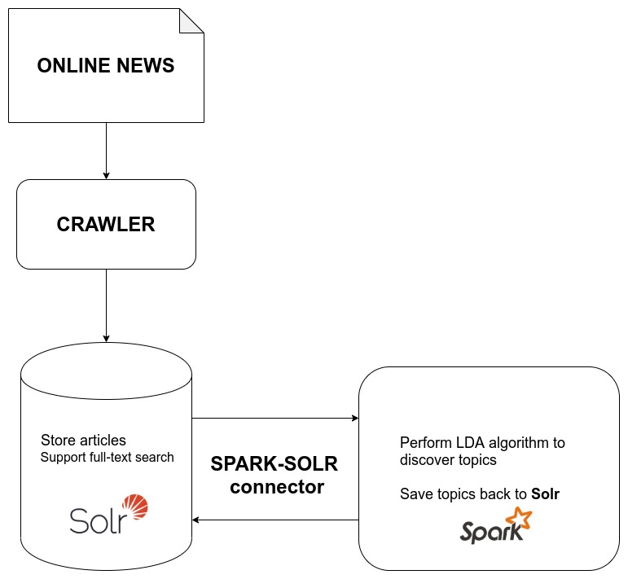
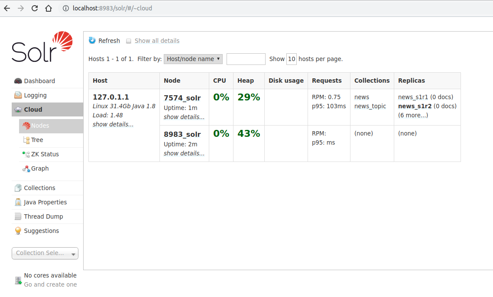
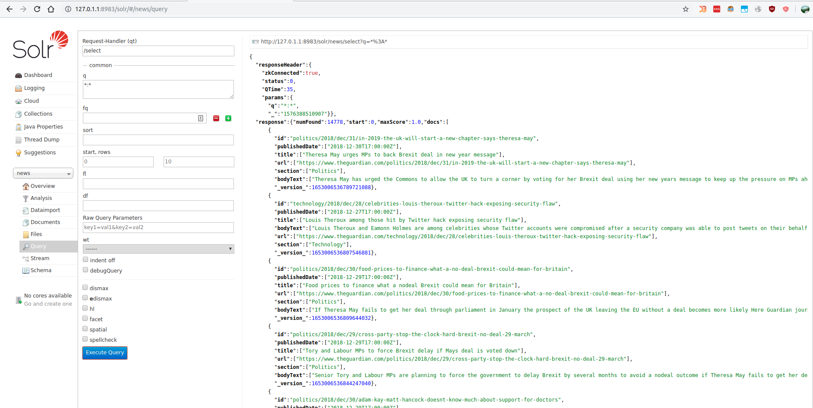

# Finding trends in news


*CS410 Final Project, Fall 2019*

Total member: `1`

| Member | Email   | Role                      |
|--------|-------|---------------------------|
| Thuc Dinh | thucd2@illinois.edu| Team leader & Member  |


## What this tool can do
The tool help find popular topics in the news during specified period.
User need to specify the start time, the end time and number of topics he/she expected to see. 
The tool then show each topic along with its keywords, word's weight and related articles for the current topic.


## Architecture



+ *[Apache Solr](https://lucene.apache.org/solr/)*: Used to store articles and support full-text search
+ *[Apache Spark](https://spark.apache.org/)*: Perform LDA algorithm to discover topics and then save the discovered topics back to *Solr* (if necessary). Apache Spark communicates with Apache Solr through the *Spark-Solr* connector.
This connector was developed by lucidworks and can be founded at [https://github.com/lucidworks/spark-solr](https://github.com/lucidworks/spark-solr)
+ *Crawler*: In reality, the tool should have a crawling component to fetch any update from some online news sites. 
However, this project use a [Kaggle's public dataset of the Guardian news](https://www.kaggle.com/sameedhayat/guardian-news-dataset) containing about 53.000 articles from the beginning of 2016 to the end of 2018.

## Download and install requirements
Below is instruction to install Apache Solr on `Ubuntu 19.10`. Other OSes or distributions of Linux may have a little bit difference.
The project use:
 + `Apache Solr 8.2.0`
 + `Java 1.8`
 + `Apache Maven 3.6.1`
 + `Scala 2.11.12`
 + `Apache Spark 2.4.4`

+ Install Apache Solr 8.2.0

   + Download Apache Solr 8.2.0

```sh
cd $YOUR_WORKING_DIR
wget https://archive.apache.org/dist/lucene/solr/8.2.0/solr-8.2.0.tgz
tar -xzvf solr-8.2.0.tgz
```

   + Start Solr in Cloud mode with 2 nodes (running locally and listening to different ports: `8983` (default) and `7574`):
   
```sh
cd $YOUR_WORKING_DIR/solr-8.2.0

# start Solr running in SolrCloud mode on default port (8983)
bin/solr start -c

# start Solr running in SolrCloud mode on port 7574 and using localhost:9983 to connect to zookeeper
bin/solr start -c -p 7574 -z localhost:9983
```

To check if everything is OK, go to [Solr Admin](http://localhost:8983/solr/#/~cloud)

You should see something like below


In the `node` column, there are two nodes: `7574_solr`, `8983_solr`. These indicate two node running and listening to 2 different specified ports.
That means we are good to go.

   + Create collections in Solr 

We need to create two collection: `news` collection to store news articles 

```sh
# create news collection with 2 shards and replication factor = 2
bin/solr create -c news  -s 2 -rf 2
```

+ Install Java 8, maven 3.6.1

Follow the link: https://linuxize.com/post/how-to-install-apache-maven-on-ubuntu-18-04/


+ Build projects from source

After install maven successfully, we can build project from source

```sh
cd $PROJECT_DIR

# package with maven
mvn clean package
```

If the build succeeded, there will be a file named `news_topic-1.0.jar` in `$PROJECT_DIR/target`

+ Download the Guardian news dataset

    1. Download from Kaggle public dataset: https://www.kaggle.com/sameedhayat/guardian-news-dataset
([another link](https://drive.google.com/open?id=1QwE3VqnCMjFeiRYT6NV1rs6AC8FnnvzW))

    2. Unzip, rename and place it in `$PROJECT_DIR/input/the_guardian_articles.csv`


## How to use

Tool can be used as a command line command with arguments

```
cd $PROJECT_DIR

java -cp target/news_topic-1.0.jar Main [options]
```

Full list of argument can be found in the table below:
```sh
Finding trends in news v1.0
Usage: news_topic-VERSION.jar Main [options]

  -m, --mode <value>       Mode to run: extract/trend
  -p, --inputPath <value>  Path of csv file containing articles to index. Default = input/the_guardian_articles.csv
  -o, --outputPath <value>
                           Path to store extract articles. Default = output/
  -c, --newsCollection <value>
                           Name of collection to index to Solr. Default: news
  --extractStartDate <value>
                           Extracting start date, format: yyyy-MM-dd. Default 2018-01-01
  --extractEndDate <value>
                           Extracting end date, format: yyyy-MM-dd. Default 2019-01-01
  --trendStartDate <value>
                           Trend start date, format: yyyy-MM-dd. Default 2018-11-01
  --trendEndDate <value>   Trend end date, format: yyyy-MM-dd. Default 2018-12-01
  -z, --zookeeper <value>  Zookeeper url, default: localhost:9983
  -t, --topics <value>     Number of topics. Default = 5
  -w, --words <value>      Number of words per topic to show. Default = 7
  -a, --articles <value>   Number of related articles to show for each topic. Default = 5
```

*You don't need* to remember all these options, just need to know the tool has two main features:
1. Index (`--mode extract`): Extract all articles published during `[extractStartDate, extractEndDate)` from input source,
perform cleaning and save to csv file before indexing to Solr. We then use Solr's `post` tool to index this csv file

Some other options:
   + `--inputPath <value>` option: the path of file containing news (csv file)
   + `--outputPath <value>` option: output path of extracted articles (csv file) 
   + `--extractStartDate <value>`, `--extractEndDate <value>` define the period of time we need to index articles of this range to Solr (and leave articles published in other ranges untouched)

2. Finding trend (`--mode trend`): Find trends / discover topics in any given period of time and show related articles of these topics.
Some other options:
   + `--trendStartDate <value>`
   + `--trendEndDate <value>` 
   + `--topics <value>`
   + `--words <value>`
   + `--articles <value>`

TL&DR:
----


1. Extract the Guardian News data set, and cleaning before indexing to Solr

```sh
java -cp target/news_topic-1.0.jar Main --mode extract --inputPath input/the_guardian_articles.csv
```

If extracting process was OK, you should see file named `part-*.csv` in `output/` folder

Indexing to Solr with `post` tool
```sh
cd $SOLR_DIR
bin/post -c news $PROJECT_DIR/output/*.csv
```

If indexing process was OK, you should see something like this in [http://127.0.1.1:8983/solr/#/news/query](http://127.0.1.1:8983/solr/#/news/query)




You can try different values for `--extractStartDate` and `--extractEndDate` to index more articles to Solr. By default, we indexed only articles published in `2018`.

2. View trends in any given time range

Discover `5` topics in articles published in `May 2018`, each topics show `8` words and `6` related articles

```sh
java -cp target/news_topic-1.0.jar Main --mode trend --trendStartDate 2018-05-01 --trendEndDate 2018-06-01 --topics 5 --words 8 --articles 6
```
The result of console is something like below:

```sh
======================
FINDING TRENDS
	 Solr's news collection: news
		 startDate = 2018-05-01 
		 endDate = 2018-06-01
		 number of topics: 5
		 words per topic: 8
		 related articles: 6
Total article in date range [2018-05-01, 2018-06-01) : 1260
Finished training LDA model.
Training time: 7.130969228 secs
Showing 5 topics and related articles: 
#################################
Topic 1 / 5
Topic word with its weight:
List((brexit,0.0044), (labour,0.0039), (customs,0.0032), (eu,0.0032), (trade,0.0028), (party,0.0027), (growth,0.0025), (uk,0.0023))
Related article: 
+-----------------------------------------------------------------------+-------------+-------------------------------------------------------------------------------------------------------------------------------+--------+
|title                                                                  |publishedDate|url                                                                                                                            |section |
+-----------------------------------------------------------------------+-------------+-------------------------------------------------------------------------------------------------------------------------------+--------+
|Brexit weekly briefing crunch time on customs union approaches         |2018-05-01   |https://www.theguardian.com/politics/2018/may/01/brexit-weekly-briefing-crunch-time-on-customs-union-approaches                |Politics|
|Brexit vote has cost each UK household 900 says Mark Carney            |2018-05-22   |https://www.theguardian.com/politics/2018/may/22/brexit-vote-cost-uk-mark-carney-bank-of-england                               |Politics|
|Brexit weekly briefing Boris Johnson launches customs union broadside  |2018-05-08   |https://www.theguardian.com/politics/2018/may/08/brexit-weekly-briefing-boris-johnson-launches-customs-union-broadside         |Politics|
|Brexit weekly briefing Irish border problem dominates debate           |2018-05-22   |https://www.theguardian.com/politics/2018/may/22/brexit-weekly-briefing-irish-border-problem-dominates-debate                  |Politics|
|Local elections haunted by Brexit offer little comfort to right or left|2018-05-06   |https://www.theguardian.com/politics/2018/may/05/local-elections-brexit-little-comfort-right-or-left                           |Politics|
|Labours choice to fight Lewisham East may be decided by Brexit views   |2018-05-18   |https://www.theguardian.com/politics/2018/may/18/labour-choice-to-fight-lewisham-east-byelection-may-be-decided-by-brexit-views|Politics|
+-----------------------------------------------------------------------+-------------+-------------------------------------------------------------------------------------------------------------------------------+--------+


..... MANY TEXT ....


#################################
Topic 5 / 5
Topic word with its weight:
List((rugby,0.0028), (players,0.0024), (season,0.0020), (cup,0.0019), (min,0.0019), (game,0.0018), (saracens,0.0018), (exeter,0.0017))
Related article: 
+------------------------------------------------------------------------------+-------------+---------------------------------------------------------------------------------------------------------------+-------+
|title                                                                         |publishedDate|url                                                                                                            |section|
+------------------------------------------------------------------------------+-------------+---------------------------------------------------------------------------------------------------------------+-------+
|Super Rugby is gravely ill but its last breath is yet to be taken  Bret Harris|2018-05-22   |https://www.theguardian.com/sport/2018/may/22/super-rugby-is-gravely-ill-but-its-last-breath-is-yet-to-be-taken|Sport  |
|HR McMaster on rugby The warrior ethos is what a good team has                |2018-05-28   |https://www.theguardian.com/sport/2018/may/28/hr-mcmaster-rugby-warrior-ethos                                  |Sport  |
|Its in my blood how rugby managed to unite Americas elite                     |2018-06-01   |https://www.theguardian.com/sport/blog/2018/jun/01/famous-american-rugby-players-wales-v-south-africa          |Sport  |
|Eddie Joness England training methods to come under scrutiny                  |2018-05-31   |https://www.theguardian.com/sport/2018/may/31/eddie-jones-england-training-scrutiny                            |Sport  |
|Super Rugby player drain looms as New Zealands biggest foe  Bret Harris       |2018-05-14   |https://www.theguardian.com/sport/2018/may/15/super-rugby-player-drain-looms-as-new-zealands-biggest-foe       |Sport  |
|Russia handed World Cup place as Romania penalised for ineligible player      |2018-05-15   |https://www.theguardian.com/sport/2018/may/15/russia-romania-rugby-world-cup-2019-ineligible-player            |Sport  |
+------------------------------------------------------------------------------+-------------+---------------------------------------------------------------------------------------------------------------+-------+
```
## How the tool was developed

The tool use Spark-Solr connector to Read from and Write to Solr. The Spark side use Spark-ML to perform LDA algorithm to discover topics.

Details on these key features are detailed below:

+ Read data from Solr to Spark

With Spark-Solr connector, Solr could be think of as a data source to Spark SQL. It's as easy to read from and write to Solr from Spark as with other data sources.
```scala
def loadArticleFromSolr(ss: SparkSession, zkHost: String, newsCollection: String): Dataset[Article] = {
    import ss.implicits._

    val options = Map(
      "zkhost" -> zkHost,
      "collection" -> newsCollection
    )

    val ds = ss.read.format("solr")
      .options(options)
      .load
      .flatMap(rowToArticle)

    ds
  }
```

+ Save data from Spark to Solr
```scala
def saveToSolr(ss: SparkSession, zkHost: String, collection: String, dataDF: DataFrame): Unit = {
    val options = Map(
      "zkhost" -> zkHost,
      "collection" -> collection,
      "gen_uniq_key" -> "true",
      "soft_commit_secs" -> "5"
    )

    dataDF
      .write
      .format("solr")
      .options(options)
      .mode(org.apache.spark.sql.SaveMode.Overwrite)
      .save
  }
```

+ Perform LDA algorithm to find topics

We do some basic transformation first.

Tokenizer
```scala
// TOKENIZER
    val tokenizer = new Tokenizer().setInputCol("bodyText").setOutputCol("words")
    val newsWithTokenizer = tokenizer.transform(newsDataset)

    val countNullWords = newsWithTokenizer
      .filter($"words".isNull)
      .count()
```

Then remove stopwords, currently using default english "stopwords" of Spark's MLLib.
```scala
    // REMOVE STOPWORDS
    val stopWords = new StopWordsRemover()
      .setInputCol(tokenizer.getOutputCol)
      .setOutputCol("filtered_words")


    val filteredStopwords = stopWords.transform(newsWithTokenizer)
```

Converts a text document to a sparse vector of token counts
```scala
    // VECTORISED
    val cvModel: CountVectorizerModel = new CountVectorizer()
      .setInputCol("filtered_words")
      .setOutputCol("features")
      .setMinDF(2)
      .fit(filteredStopwords)

    val afterPreprocessed = cvModel.transform(newsInRange)
```

Penalize popular terms/tokens by using Inverse Document Frequency (IDF)
```scala
    //  IDF
    val idf = new IDF()
      .setInputCol(cvModel.getOutputCol)
      .setOutputCol("features_tfidf")

    val rescaled = idf.fit(afterPreprocessed).transform(afterPreprocessed)
    rescaled.persist()

    val vocabArray = cvModel.vocabulary

    val documents = rescaled
      .select("features_tfidf")
      .rdd
      .map {
        case Row(features: MLVector) => Vectors.fromML(features)
      }
      .zipWithIndex()
      .map(_.swap)
```

Perform LDA algorithm
```scala
    val lda = new LDA()
    lda.setK(nTopic)

    val ldaModel = lda.run(documents)
    val topicIndices = ldaModel.describeTopics(maxTermsPerTopic = nWord)
```

+ Finding `top-n` related articles for a given topic

We get from topic the top words, and use these words to search for articles. Ranking these articles by scores and retrieve the top.
Leverage Solr's search power to do this task.

```scala
val words = rangedTopic.words.mkString(" ")
 val relatedArticles = ss.read.format("solr")
        .[....]
      .option("query", s"bodyText: $words")     //  <= using topic's words to search with Solr
      .option("solr.params", "sort=score desc") //  <= ranking articles by score in descending order 
      .option("max_rows", maxArticle)           //  <= retrieving some top related articles    
```
